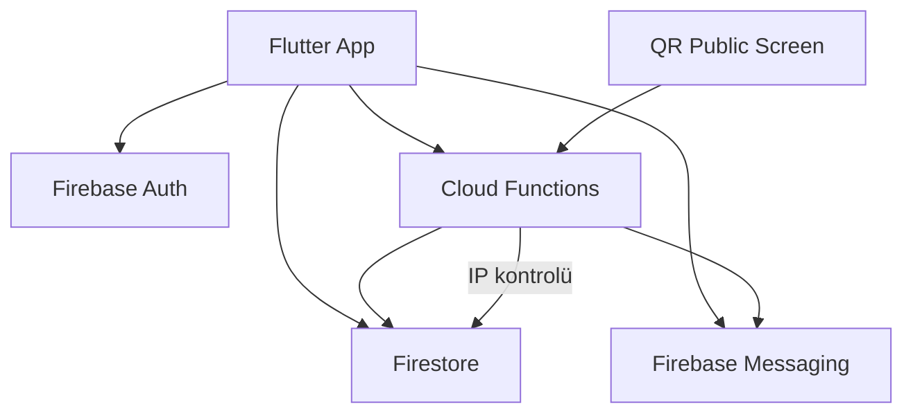

# AGENTS.md
This file provides guidance to Verdent when working with code in this repository.

## Table of Contents
1. Commonly Used Commands
2. High-Level Architecture & Structure
3. Key Rules & Constraints
4. Development Hints

---

## Commands

- **Run app (Android):** `$env:PATH += ";C:\Gelistirme\bin" ; cd C:\Projeler\otodna ; flutter run`
- **Clean + rebuild:** `flutter clean ; flutter pub get ; flutter run`
- **Analyze:** `flutter analyze lib/`
- **Deploy Cloud Functions:** `firebase deploy --only functions` *(requires Firebase Blaze plan)*
- **Functions emulator (functions only):** `firebase emulators:start --only functions` *(Firestore emulator requires Java)*
- **Add Flutter PATH in PowerShell:** `$env:PATH += ";C:\Gelistirme\bin"`
- **Run flutterfire:** `& "$env:USERPROFILE\AppData\Local\Pub\Cache\bin\flutterfire.bat" configure`

---

## Architecture

- **Flutter mobile app** — Entry point: `lib/main.dart` → `_AuthGate` (StreamBuilder on Firebase Auth) → `login_screen.dart` or `home_screen.dart`
- **Firebase backend** — Project ID: `otodna-c3747`
  - Auth: email+password via `lib/services/auth_service.dart`
  - Firestore: vehicle records, bildirimler sub-collection, user data
  - FCM: push notifications via `lib/services/notification_service.dart`
  - Cloud Functions: `functions/index.js` (Node.js v20, Firebase Functions v2)
- **Active screens** (used in production flow):
  - `lib/screens/login_screen.dart` — giriş ekranı (email+QR), animasyonlu arka plan
  - `lib/screens/qr_public_screen.dart` — herkese açık QR bildirim sayfası (giriş gerekmez)
  - `lib/screens/bildirimler_screen.dart` — araç sahibi bildirim listesi
  - `lib/screens/bildirim_detay_screen.dart` — bildirim detayı + IP engelleme + hızlı yanıt
  - `lib/screens/home_screen.dart` — giriş sonrası ana sayfa
- **[inferred]** `lib/` root'undaki `.dart` dosyaları (ariza_kaydi, bayi_paneli vb.) önceki Gemini oturumundan kalan taslak dosyalar — `main.dart`'ta import edilmiyorlar, aktif değiller
- **Widgets:** `lib/widgets/otodna_logo_painter.dart` — CustomPainter logo (aktif ama login_screen şu an `Image.asset('assets/images/otodna_logo.png')` kullanıyor)

### Firestore Veri Modeli
```
/vehicles/{saseNo}
  - plaka, sahibiAdi, sahibiSoyadi, sahibiUid
  - fcmToken, engelliIpler: List<string>

/vehicles/{saseNo}/bildirimler/{bildirimId}
  - tur, mesaj, gonderenIp, tarih, okundu, durum, cevap
  - durum: 'gonderildi' | 'alindi' | 'okundu'
```

### QR Bildirim Akışı
```
QR okutulur → QrPublicScreen → bildirimGonder (Cloud Fn)
  → Firestore yazar (durum: gonderildi)
  → FCM push → durum: alindi
  → Araç sahibi açar → durum: okundu (bildirimOkunduTrigger)
  → QR ekranında WhatsApp tik sistemi canlı güncellenir (Firestore stream)
```

### Mermaid


---

## Key Rules & Constraints

- **PowerShell syntax** — komutları `;` ile birleştir, `export` kullanma, `$env:VAR` kullan
- **Flutter PATH** — `C:\Gelistirme\bin` — her yeni PowerShell oturumunda `$env:PATH += ";C:\Gelistirme\bin"` gerekli
- **flutterfire CLI PATH** — `C:\Users\thinkpad\AppData\Local\Pub\Cache\bin`
- **Proje klasörü:** `C:\Projeler\otodna\` — `C:\Projeler\` root'una değil buraya `cd` yap
- **Firebase plan:** Cloud Functions deploy için Blaze (kullandıkça öde) planı gerekli; şu an Spark plan
- **Firestore emülatörü** Java gerektirir — sistemde Java yok, sadece `--only functions` emülatörü çalışır
- **QR format:** `OTODNA:{saseNo}` — `_handleQRDetect` bu formatı doğruluyor
- **Assets** mutlaka `pubspec.yaml`'da tanımlı olmalı (`assets/images/` altında)
- **[inferred]** `lib/` root'undaki eski taslak dosyaları silme — derlemeyi bozmaz ama karmaşıklık yaratır
- `withOpacity()` deprecated → `withValues(alpha: ...)` kullan
- **Duplicate login screen sorunu:** `lib/screens/login_screen.dart` aktif olan; `lib/ui/login_screen.dart`, `lib/screens/auth/login_screen.dart`, `lib/giris_sayfasi.dart` eski/kullanılmayan kopyalar

---

## Development Hints

- **Yeni ekran eklerken** `lib/screens/` altına koy, `home_screen.dart`'tan `Navigator.push` ile aç
- **Yeni Cloud Function eklerken** `functions/index.js`'e `onCall` ile ekle, `firebase deploy --only functions` çalıştır (Blaze gerekli)
- **FCM token kaydı** — araç sahibi giriş yapınca `NotificationService.getToken()` çağrılıp `vehicles/{saseNo}/fcmToken` alanına yazılmalı (şu an otomatik yapılmıyor)
- **IP engelleme** `vehicle_service.dart::engelleIp()` → `engelliIpler` array'ine `arrayUnion` ile ekler; Cloud Function `ipEngelle` daha güvenli alternatif
- **`bildirimOkunduTrigger`** Firestore emülatörü olmadan test edilemez; production'da Blaze ile deploy edilince aktif olur
- **Logo görseli** `assets/images/otodna_logo.png` — değiştirmek için dosyayı üzerine yaz, `flutter clean` yap
- **Arka plan görseli** `assets/images/siber_zemin_altin_kanalli.png` — `login_screen.dart::_buildBackground()` içinde kullanılıyor
- **`_CircuitFlowPainter`** arka planda altın kanal akış animasyonu — `_particleCtrl` controller'ına bağlı (3s repeat)
