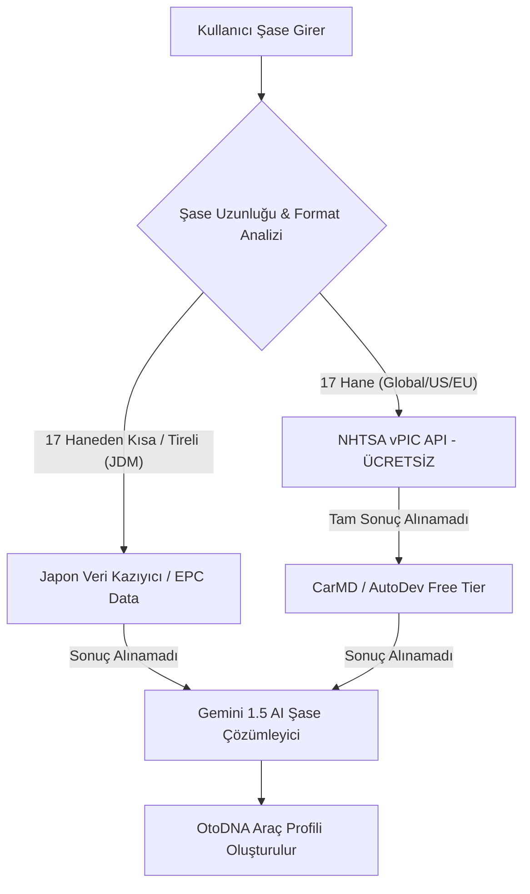

# OtoDNA Kuantum Veri Yönlendiricisi (Siber Şase & Araç Tanıma Motoru)

Bu belge, OtoDNA platformunun küresel çapta (Amerika, Avrupa, Japonya) üretilmiş tüm araçların şase (VIN) numaralarını sıfır veya minimum maliyetle, otonom olarak çözümlemesi için tasarlanan **Kuantum Veri Yönlendiricisi** mimarisini ve kullanılacak ücretsiz API stratejilerini tanımlar.

## 1. Mimari Genel Bakış: Kuantum Veri Yönlendiricisi

OtoDNA uygulaması, kullanıcıdan aldığı şase numarasını doğrudan tek bir ücretli servise göndermek yerine, bir "Yönlendirici" (Router) süzgecinden geçirir. Bu süzgeç, şasenin formatını analiz ederek en uygun ve **ücretsiz** veri kaynağına istek atar.

## 2. Bölgesel Veri Kaynakları ve Ücretsiz API'ler

### 2.1. Amerika ve Küresel Pazarlar (17 Haneli Standart VIN)
Dünya üzerindeki araçların büyük bir çoğunluğu bu kategoriye girer.
*   **Kullanılacak Servis:** **NHTSA vPIC API** (National Highway Traffic Safety Administration)
*   **Maliyet:** Tamamen Ücretsiz, Limitsiz.
*   **Veri Seti:** Marka, Model, Yıl, Kasa Tipi, Motor Gücü, Üretim Yeri vb.
*   **Entegrasyon Yöntemi:** REST API GET isteği (`https://vpic.nhtsa.dot.gov/api/vehicles/decodevin/`)

### 2.2. Avrupa Araçları (Özel Üretim VAG, PSA, Fiat vb.)
NHTSA'nın tam olarak çözemediği Avrupa spesifik araçlar için devreye girer.
*   **Kullanılacak Servis:** **CarMD API** veya **AutoDev API**
*   **Maliyet:** Free-tier (Aylık 100-500 sorgu arası ücretsiz).
*   **Strateji:** Sadece NHTSA'dan "Bilinmeyen" yanıtı gelirse bu API'ler tetiklenir. Böylece ücretsiz kota çok uzun süre dayanır.

### 2.3. Safkan Japon Araçları (JDM - Sağdan Direksiyonlu)
Japon iç pazarı için üretilen araçlar 17 haneli standart VIN kullanmaz (Örn: `JZX100-0123456`). Bu araçlar için resmi ve ücretsiz bir API yoktur.
*   **Kullanılacak Servis:** EPC (Electronic Parts Catalog) siteleri (`epc-data.com`, `partsouq.com` vb.)
*   **Maliyet:** Ücretsiz (Veri Kazıma / Web Scraping yöntemiyle).
*   **Strateji:** Sistem, girilen şasenin kısa veya tireli olduğunu fark ederse, arka planda bu sitelere istek atarak HTML sayfasından aracın bilgilerini çeker (parse eder).

### 2.4. Son Çare: Kuantum Zeka (Gemini AI Şase Çözümleyici)
Hiçbir API veya veri tabanının sonuç döndüremediği "Ghost" (Hayalet) şaseler veya çok eski klasikler için devreye girer.
*   **Kullanılacak Servis:** **Google Gemini 1.5** (AI Studio API)
*   **Maliyet:** Dakikada 15 isteğe kadar Ücretsiz.
*   **Strateji:** Şase numarası doğrudan Gemini'ye bir prompt ile iletilir: *"Sen uzman bir otomotiv kriminalistisin. Aşağıdaki şase numarasının içindeki WMI ve VDS kodlarını analiz ederek aracın markasını, tahmini üretim yılını ve bölgesini çıkar."*

## 3. Kodlama Hedefleri (Gelecek Adımlar)

Bu mimariyi koda dökmek için projeye şu servis dosyaları eklenecektir:
1.  `lib/services/sase/kuantum_sase_router.dart`: Gelen şaseyi analiz edip uygun API'ye yönlendiren ana beyin.
2.  `lib/services/sase/nhtsa_api_service.dart`: Amerikan devleti API'si ile haberleşen modül.
3.  `lib/services/sase/jdm_scraper_service.dart`: Japon araçlarını parça kataloglarından kazıyan modül.
4.  `lib/services/sase/gemini_fallback_service.dart`: Yapay zeka destekli son çare çözümleyici.

## 4. Ekstra: Siber Navigasyon (Harita) Alternatifleri
Google Maps API ücretlerinden kaçınmak için Siber Navigasyon altyapısında:
*   **Harita Gösterimi:** `flutter_map` ve OpenStreetMap (Sıfır Maliyet, Kredi Kartsız)
*   **Rota ve Yönlendirme:** Mapbox Free Tier (Aylık 50.000 yükleme ücretsiz) veya OSRM (Open Source Routing Machine - Tamamen Ücretsiz) kullanılacaktır.

## 5. OtoDNA Market: Google Hub Görsel Çekim Stratejisi ve Maliyetler

OtoDNA Market'e (Trendyol/Sahibinden modülü) ürün (yedek parça veya araç) eklendiğinde, sistemin ürün görsellerini otomatik olarak dış bir "Google Hub" kaynağından (örneğin Google Custom Search API veya harici bir OE Hub görsel havuzu) çekmesi planlanmaktadır.

### Ücret Yansıması ve Strateji:
1.  **Google Custom Search API (Görsel Arama):**
    *   **Maliyet:** Google, günlük **100 sorguya kadar ücretsiz** kullanım hakkı sunar. Bu limit aşıldığında her 1.000 sorgu için ortalama **5$** ücretlendirilir.
    *   **Optimizasyon (Önbellekleme/Caching):** API maliyetlerini sıfıra indirmek için "Siber Önbellek" stratejisi uygulanmalıdır. Bir bayinin eklediği ürünün (Örn: `BOSCH-12345` referanslı fren balatası) görseli Google'dan 1 kez çekilir ve anında **OtoDNA Firebase Storage'a** (bizim kendi ücretsiz veritabanımıza) kaydedilir. Aynı ürünü başka bir bayi eklediğinde, Google'a para ödemek yerine kendi veritabanımızdaki görsel kullanılır.
2.  **Global OE Hub Bağlantısı (Parça Katalogları):**
    *   Eğer Google yerine otomotiv sektörüne özel bir "OE Hub" (Örn: TecDoc) API'si kullanılırsa, bu sistemlerin genellikle aylık sabit bir abonelik ücreti olur (kullanıma bağlı değil).
3.  **Firebase Storage (Kendi Kuantum Depomuz):**
    *   Google Hub'dan çekilip Firebase'e kaydedilen görsellerin gösterimi, Firebase'in ücretsiz kotası (Günlük 1 GB indirme) içinde kalır. Market büyüdükçe sadece veri aktarım ücreti (Gigabyte başına çok düşük sentler) ödenir.

**Sonuç:** Görsel çekim motoruna bir "Cache" (Önbellek) katmanı kodlandığı takdirde, OtoDNA Market'in dışarıdan görsel alma maliyeti aylık bazda neredeyse sıfıra yakın tutulabilir.

---
*Bu doküman, OtoDNA'nın sıfır maliyetle maksimum veri istihbaratı sağlama vizyonuna (Steel Core Doctrine) uygun olarak hazırlanmıştır.*
